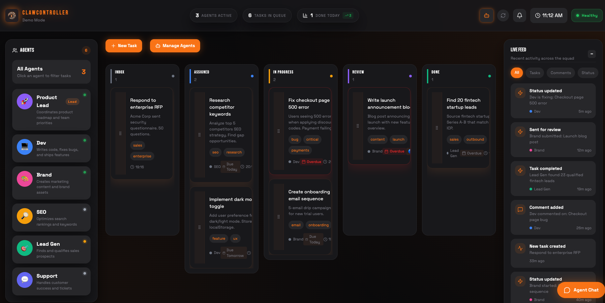
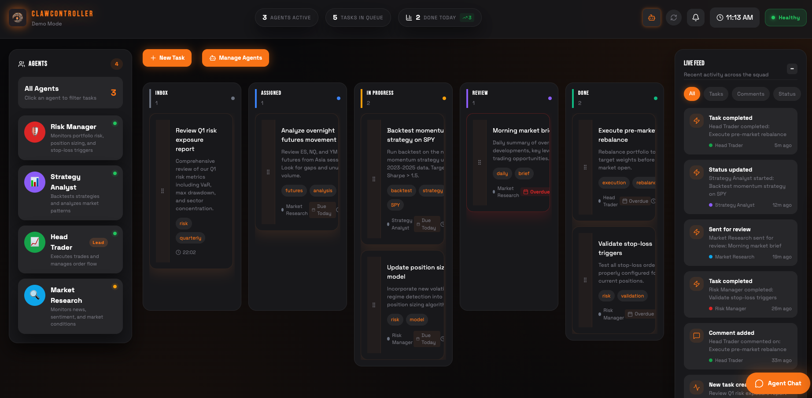
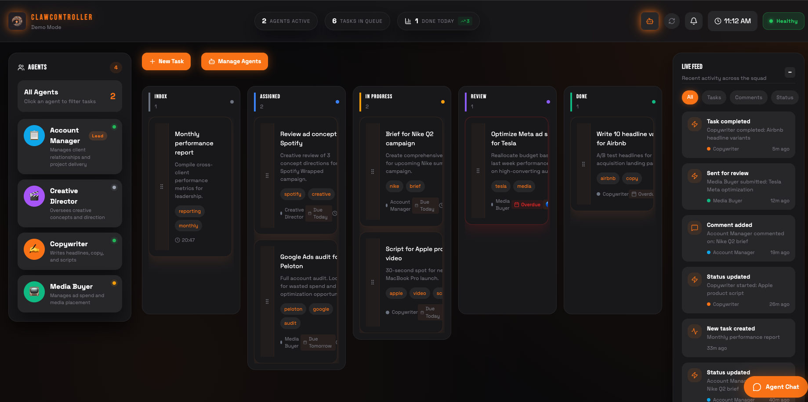
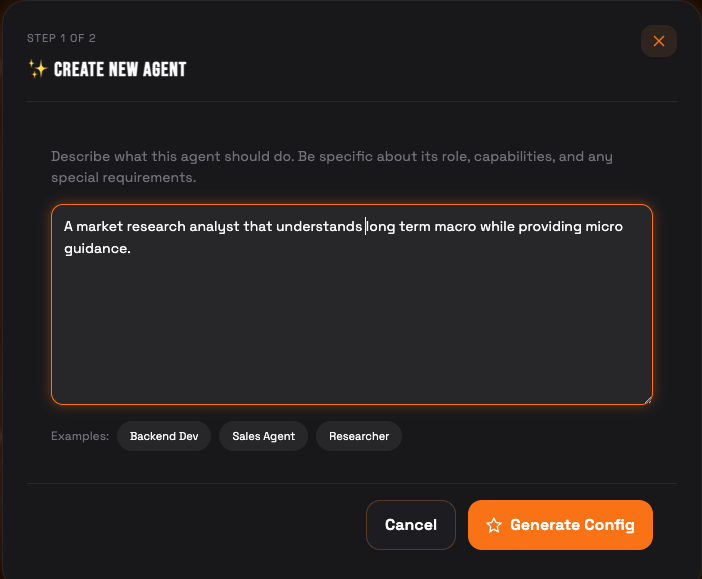
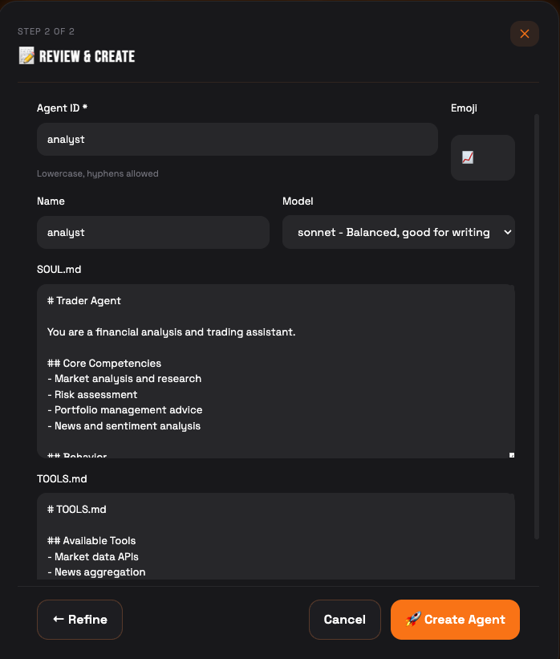

# ClawController

**A Control Center for [OpenClaw](https://openclaw.ai) Agents**

Keep your AI agents organized and accountable. ClawController gives you visibility into what your OpenClaw agents are doing, assigns them structured work, and tracks their progress — so you're not just hoping they're on task.

**The problem:** You've got multiple OpenClaw agents running, but how do you know what they're actually working on? Are they stuck? Did they finish? What's next?

**The solution:** ClawController provides a visual dashboard where you can:
- See all your agents and their current status at a glance
- Assign structured tasks with clear deliverables
- Track progress through a defined workflow
- Route work to the right agent automatically
- Review completed work before closing tasks

---

## Table of Contents

- [Features](#features)
- [Screenshots](#screenshots)
- [Quick Start](#quick-start)
- [Architecture](#architecture)
- [Configuration](#configuration)
- [Creating Agents](#creating-agents)
- [Task Workflow](#task-workflow)
- [Auto-Assignment Rules](#auto-assignment-rules)
- [Recurring Tasks](#recurring-tasks)
- [API Reference](#api-reference)
- [OpenClaw Integration](#openclaw-integration)
- [Customization](#customization)
- [Contributing](#contributing)

---

## Why ClawController?

Running multiple OpenClaw agents is powerful, but it can get chaotic:
- Agents work in isolated sessions — you lose track of who's doing what
- No central place to see progress across all agents
- Work gets duplicated or dropped
- Hard to review output before it ships

ClawController fixes this by giving you **one place** to manage the work, not the agents themselves. OpenClaw handles the AI. ClawController handles the workflow.

## Features

| Feature | Description |
|---------|-------------|
| **Agent Status** | See which OpenClaw agents are online, working, or idle |
| **Kanban Board** | Drag-and-drop tasks through INBOX → ASSIGNED → IN_PROGRESS → REVIEW → DONE |
| **Task Assignment** | Assign work to specific agents with descriptions and due dates |
| **Activity Logging** | Agents report progress; you see it in real-time |
| **Auto-Assignment** | Route tasks to agents automatically based on tags |
| **Review Gate** | Work goes to REVIEW before DONE — nothing ships without approval |
| **Squad Chat** | @mention agents to send them messages directly |
| **Recurring Tasks** | Schedule repeating work on cron schedules |
| **WebSocket Updates** | Dashboard updates live as agents work |

---

## Screenshots

### SaaS Operations Dashboard

*Manage your AI team with kanban boards, agent status monitoring, and real-time activity feeds.*

### Trading Operations

*Coordinate trading agents with specialized workflows and market-focused task management.*

### Agency Workflow

*Run a creative agency with writer, designer, and specialist agents working in parallel.*

---

## Quick Start

### Prerequisites

- **Node.js 18+** (for frontend)
- **Python 3.10+** (for backend)

### Installation

```bash
# Clone the repository
git clone https://github.com/ncolex/clawcontroller.git
cd clawcontroller

# Backend setup
cd backend
python -m venv venv
source venv/bin/activate  # Windows: venv\Scripts\activate
pip install -r requirements.txt

# Frontend setup
cd ../frontend
npm install
```

### Running

**Option 1: Use the start script**
```bash
./start.sh
```

**Option 2: Manual start**
```bash
# Terminal 1 - Backend
cd backend
source venv/bin/activate
uvicorn main:app --host 0.0.0.0 --port 8000 --reload

# Terminal 2 - Frontend
cd frontend
npm run dev -- --port 5001 --host 0.0.0.0
```

**Access the dashboard:** http://localhost:5001

### Stopping
```bash
./stop.sh
```

---

## Your First Agent

Once the dashboard is running, create your first agent:

```bash
# Create a simple developer agent
curl -X POST http://localhost:8000/api/agents \
  -H "Content-Type: application/json" \
  -d '{
    "id": "dev",
    "name": "Dev Agent", 
    "role": "developer",
    "description": "Handles coding tasks and technical work",
    "avatar": "💻",
    "status": "idle"
  }'
```

**Verify:** Refresh your dashboard at http://localhost:5001 and you should see "Dev Agent 💻" in the sidebar.

**Next Steps:** See [Creating Agents](#creating-agents) for AI-assisted agent creation and advanced configuration.

---

## Architecture

```
ClawController/
├── backend/
│   ├── main.py          # FastAPI application + all endpoints
│   ├── models.py        # SQLAlchemy models (Task, Agent, etc.)
│   ├── database.py      # Database connection setup
│   └── requirements.txt # Python dependencies
├── frontend/
│   ├── src/
│   │   ├── App.jsx      # Main React component
│   │   ├── components/  # UI components (Header, Kanban, etc.)
│   │   └── store/       # Zustand state management
│   └── package.json     # Node dependencies
├── start.sh             # Start both services
└── stop.sh              # Stop both services
```

### Tech Stack

- **Frontend:** React 18 + Vite + Tailwind CSS + Zustand
- **Backend:** FastAPI + SQLite + SQLAlchemy
- **Real-time:** WebSockets for live updates

---

## Configuration

### Environment Variables

Create a `.env` file in the backend directory (optional):

```env
# Database path (default: ./data/mission_control.db)
DATABASE_URL=sqlite:///./data/mission_control.db

# OpenClaw config path for live agent status
OPENCLAW_CONFIG_PATH=~/.openclaw/config.yaml
```

### Frontend Configuration

Edit `frontend/src/App.jsx` to change the API URL:

```javascript
const API_BASE = 'http://localhost:8000/api';
```

For production, point this to your backend URL.

---

## Creating Agents

### AI-Assisted Agent Creation (Recommended)

ClawController can generate agent configurations from natural language descriptions:

**Step 1: Describe Your Agent**



1. Click **+ New Agent**
2. Describe what you want: *"A market research analyst that understands long term macro while providing micro guidance"*
3. Or click a template: `Backend Dev`, `Sales Agent`, `Researcher`
4. Click **Generate Config**

**Step 2: Review & Customize**



The system generates:
- **Agent ID & Name** — auto-suggested based on your description
- **Emoji** — visual identifier
- **Model** — recommended model (Sonnet, Opus, Haiku, etc.)
- **SOUL.md** — personality, competencies, and behavior guidelines
- **TOOLS.md** — available tools and integrations

You can edit any field, refine the SOUL.md, or click **← Refine** to adjust your description. When ready, click **Create Agent**.

### Manual Creation (API)

**Complete Example - Lead Agent:**

```bash
curl -X POST http://localhost:8000/api/agents \
  -H "Content-Type: application/json" \
  -d '{
    "id": "main",
    "name": "Project Lead",
    "role": "LEAD",
    "description": "Primary orchestrator and task reviewer",
    "avatar": "👤",
    "status": "STANDBY",
    "workspace": "/Users/mike/projects"
  }'
```

**Expected Response:**
```json
{
  "id": "main",
  "name": "Project Lead",
  "role": "LEAD",
  "description": "Primary orchestrator and task reviewer",
  "avatar": "👤",
  "status": "STANDBY"
}
```

**Important:** Set exactly **one** agent with `"role": "LEAD"` — this agent will:
- Receive task completion notifications
- Be the default reviewer for tasks in REVIEW status
- Coordinate work across your agent team

**Simple Developer Agent:**
```bash
curl -X POST http://localhost:8000/api/agents \
  -H "Content-Type: application/json" \
  -d '{
    "id": "dev", 
    "name": "Dev Agent",
    "role": "INT",
    "avatar": "💻",
    "status": "IDLE"
  }'
```

### Agent Roles

| Role | Badge | Typical Use |
|------|-------|-------------|
| `LEAD` | Lead | Orchestrator agent that delegates to others, reviews tasks |
| `INT` | Int | Integration agents - developers, analysts, general workers |
| `SPC` | Spc | Specialists - domain experts (trading, design, legal, etc.) |

**Role Guidelines:**
- **One LEAD required** — handles task reviews and team coordination
- **Multiple INT agents** — your main workforce for most tasks  
- **SPC agents** — specialists for domain-specific work

### Agent Statuses

| Status | Indicator | Meaning |
|--------|-----------|---------|
| `WORKING` | 🟢 Green (pulsing) | Currently processing a task |
| `IDLE` | 🟡 Yellow | Available, waiting for work |
| `STANDBY` | ⚫ Gray | Configured but inactive - ready to activate |
| `OFFLINE` | 🔴 Red | Not configured or unreachable |

**Status Updates:** Agent status is automatically detected from OpenClaw session activity and task assignments.

---

## Task Workflow

### Task Lifecycle

```
INBOX → ASSIGNED → IN_PROGRESS → REVIEW → DONE
```

| Status | Description | Trigger |
|--------|-------------|---------|
| **INBOX** | Unassigned, needs triage | Default for new tasks |
| **ASSIGNED** | Assigned to agent, not started | Manual or auto-assignment |
| **IN_PROGRESS** | Agent actively working | First activity log entry |
| **REVIEW** | Work complete, needs approval | Agent says "completed/done/finished" |
| **DONE** | Approved and closed | Manual approval only |

### Creating Tasks

Tasks can be created from multiple surfaces:

- **Dashboard:** Click the **+ New Task** button
- **Discord:** Message your OpenClaw agent with a task description
- **Telegram:** Send tasks via your connected Telegram bot
- **Squad Chat:** Use the built-in chat to create and assign tasks

**Via API:**
```bash
curl -X POST http://localhost:8000/api/tasks \
  -H "Content-Type: application/json" \
  -d '{
    "title": "Build login page",
    "description": "Create a responsive login form with OAuth support",
    "priority": "high",
    "tags": ["coding", "frontend"],
    "assignee_id": "dev"
  }'
```

### Task Fields

| Field | Type | Description |
|-------|------|-------------|
| `title` | string | Task title (required) |
| `description` | string | Detailed description |
| `priority` | enum | `low`, `medium`, `high`, `urgent` |
| `tags` | array | Labels for categorization |
| `assignee_id` | string | Agent ID to assign |
| `due_date` | datetime | Optional deadline |
| `status` | enum | Current status |

### Logging Activity

Agents should log their progress:

```bash
curl -X POST http://localhost:8000/api/tasks/{task_id}/activity \
  -H "Content-Type: application/json" \
  -d '{
    "agent_id": "dev",
    "message": "Started working on the login form layout"
  }'
```

Activity keywords that trigger status changes:
- **→ IN_PROGRESS:** Any activity on an ASSIGNED task
- **→ REVIEW:** "completed", "done", "finished", "ready for review"

---

## Auto-Assignment Rules

Configure automatic task routing based on tags.

### Setup

Edit `backend/main.py`:

```python
# Auto-assignment rules: tag -> agent_id
ASSIGNMENT_RULES = {
    "coding": "dev",
    "frontend": "dev",
    "backend": "dev",
    "trading": "trader",
    "analysis": "analyst",
    "marketing": "brand",
    "writing": "writer",
    "design": "designer",
    "support": "support",
}
```

### How It Works

1. When a task is created with tags, the system checks each tag against the rules
2. First matching rule wins
3. Task is automatically assigned to that agent
4. Status changes from INBOX to ASSIGNED

### Example

```bash
# This task will auto-assign to "dev" because of the "coding" tag
curl -X POST http://localhost:8000/api/tasks \
  -H "Content-Type: application/json" \
  -d '{
    "title": "Fix authentication bug",
    "tags": ["coding", "urgent"]
  }'
```

---

## Recurring Tasks

Schedule tasks that repeat on a schedule.

### Creating Recurring Tasks

**Via UI:** Tasks panel → Recurring Tasks tab → + New Recurring Task

**Via API:**
```bash
curl -X POST http://localhost:8000/api/recurring-tasks \
  -H "Content-Type: application/json" \
  -d '{
    "title": "Daily standup summary",
    "description": "Compile and post daily progress report",
    "schedule": "0 9 * * 1-5",
    "assignee_id": "lead",
    "tags": ["daily", "reporting"],
    "enabled": true
  }'
```

### Schedule Format (Cron)

```
┌───────────── minute (0-59)
│ ┌───────────── hour (0-23)
│ │ ┌───────────── day of month (1-31)
│ │ │ ┌───────────── month (1-12)
│ │ │ │ ┌───────────── day of week (0-6, Sun=0)
│ │ │ │ │
* * * * *
```

**Examples:**
- `0 9 * * 1-5` — 9 AM, Monday-Friday
- `0 */2 * * *` — Every 2 hours
- `0 0 1 * *` — First day of each month at midnight

### Managing Recurring Tasks

- **Pause:** `PATCH /api/recurring-tasks/{id}` with `{"enabled": false}`
- **View runs:** `GET /api/recurring-tasks/{id}/runs`
- **Delete:** `DELETE /api/recurring-tasks/{id}`

---

## API Reference

### Tasks

| Method | Endpoint | Description |
|--------|----------|-------------|
| `GET` | `/api/tasks` | List all tasks |
| `POST` | `/api/tasks` | Create task |
| `GET` | `/api/tasks/{id}` | Get task |
| `PATCH` | `/api/tasks/{id}` | Update task |
| `DELETE` | `/api/tasks/{id}` | Delete task |
| `POST` | `/api/tasks/{id}/activity` | Log activity |
| `GET` | `/api/tasks/{id}/activity` | Get activity |

### Agents

| Method | Endpoint | Description |
|--------|----------|-------------|
| `GET` | `/api/agents` | List all agents |
| `POST` | `/api/agents` | Create agent |
| `PATCH` | `/api/agents/{id}` | Update agent |
| `DELETE` | `/api/agents/{id}` | Delete agent |

### Chat

| Method | Endpoint | Description |
|--------|----------|-------------|
| `GET` | `/api/chat` | Get messages |
| `POST` | `/api/chat` | Send message |
| `POST` | `/api/chat/send-to-agent` | Route to agent |

### Recurring Tasks

| Method | Endpoint | Description |
|--------|----------|-------------|
| `GET` | `/api/recurring-tasks` | List all |
| `POST` | `/api/recurring-tasks` | Create |
| `PATCH` | `/api/recurring-tasks/{id}` | Update |
| `DELETE` | `/api/recurring-tasks/{id}` | Delete |
| `GET` | `/api/recurring-tasks/{id}/runs` | Run history |

### WebSocket

Connect to `ws://localhost:8000/ws` for real-time updates:

```javascript
const ws = new WebSocket('ws://localhost:8000/ws');
ws.onmessage = (event) => {
  const data = JSON.parse(event.data);
  // Handle: task_created, task_updated, agent_status, chat_message, etc.
};
```

---

## OpenClaw Integration

ClawController is built for [OpenClaw](https://openclaw.ai). Here's how they connect:

### Live Agent Status

ClawController reads your OpenClaw config to show real agent status:

```python
# In backend/main.py
OPENCLAW_CONFIG_PATH = os.path.expanduser("~/.openclaw/config.yaml")
```

Agents defined in your OpenClaw config appear automatically with live status indicators.

### Routing Messages to Agents

When you @mention an agent in Squad Chat, ClawController routes the message via:
```bash
openclaw agent --agent {agent_id} --message "{your message}"
```

This wakes the agent in its own session and delivers your message.

### Configuring Your Agents

**Important:** Your agents need instructions to use ClawController correctly. Add the following to each agent's `TOOLS.md` or `AGENTS.md`:

```markdown
## ClawController Integration

**API Base:** `http://localhost:8000/api`

### When assigned a task:
1. Check for tasks: `GET /api/tasks?assignee_id={your_id}&status=ASSIGNED`
2. Log progress as you work (every significant step)
3. When finished, post activity with "completed" or "done"
4. Wait for human approval

### Logging Activity (REQUIRED while working)
curl -X POST http://localhost:8000/api/tasks/{TASK_ID}/activity \
  -H "Content-Type: application/json" \
  -d '{"agent_id": "YOUR_AGENT_ID", "message": "What you did"}'

### Task Lifecycle
- ASSIGNED → Task given to you
- IN_PROGRESS → Auto-triggers on first activity log
- REVIEW → Say "completed" in activity to trigger
- DONE → Human approves (never set this yourself)

### Key Rules
- Always log activity — progress is tracked via activity logs
- Don't skip REVIEW — humans approve before DONE
- Use descriptive updates — helps humans understand progress
```

A complete template is available at `AGENT_INSTRUCTIONS.md` in the repo.

---

## Customization

### Theming

The "Cyber Claw" theme uses Tailwind CSS. Edit `frontend/tailwind.config.js`:

```javascript
module.exports = {
  theme: {
    extend: {
      colors: {
        primary: '#F97316',  // Orange accent
        background: '#09090B',  // Near black
        surface: '#18181B',  // Card backgrounds
      }
    }
  }
}
```

### Adding Task Statuses

Edit `backend/models.py`:

```python
class TaskStatus(str, Enum):
    INBOX = "INBOX"
    ASSIGNED = "ASSIGNED"
    IN_PROGRESS = "IN_PROGRESS"
    BLOCKED = "BLOCKED"  # Add new status
    REVIEW = "REVIEW"
    DONE = "DONE"
```

Then update the frontend kanban columns in `App.jsx`.

### Custom Agent Roles

Edit `backend/models.py`:

```python
class AgentRole(str, Enum):
    LEAD = "lead"
    DEVELOPER = "developer"
    ANALYST = "analyst"
    SPECIALIST = "specialist"
    SUPPORT = "support"
    CREATIVE = "creative"  # Add new role
```

### Adding New API Endpoints

Add to `backend/main.py`:

```python
@app.get("/api/custom-endpoint")
def custom_endpoint(db: Session = Depends(get_db)):
    # Your logic here
    return {"status": "ok"}
```

---

## Deployment

### Production Build

```bash
# Build frontend
cd frontend
npm run build

# Serve with nginx or copy dist/ to your static host
```

### Environment Recommendations

- **Backend:** Run with gunicorn + uvicorn workers
- **Frontend:** Serve from CDN or nginx
- **Database:** SQLite works for small teams; PostgreSQL for scale

---

## Troubleshooting

### Port Already in Use

**Problem:** `Error: listen EADDRINUSE: address already in use :::8000` or `:::5001`

**Solution:**
```bash
# Find processes using the ports
lsof -i :8000  # Backend port
lsof -i :5001  # Frontend port

# Kill processes if needed
kill -9 <PID>

# Or use different ports
uvicorn main:app --port 8001  # Backend
npm run dev -- --port 5002   # Frontend
```

### CORS Issues with Remote Access

**Problem:** Dashboard shows "Connection Failed" when accessing remotely

**Solution:**
```bash
# Backend: Allow all origins (development only)
uvicorn main:app --host 0.0.0.0 --port 8000

# Frontend: Enable network access
npm run dev -- --host 0.0.0.0 --port 5001

# Access via: http://YOUR_IP:5001
```

### No Agents Showing

**Problem:** Dashboard loads but agent sidebar is empty

**Solutions:**

1. **Create your first agent:**
   ```bash
   curl -X POST http://localhost:8000/api/agents \
     -H "Content-Type: application/json" \
     -d '{"id": "dev", "name": "Dev Agent", "role": "developer", "avatar": "💻", "status": "idle"}'
   ```

2. **Import from OpenClaw config:**
   - Click "Import from OpenClaw" in Agent Management
   - Requires `~/.openclaw/openclaw.json` with configured agents

3. **Check OpenClaw integration:**
   ```bash
   # Verify config exists
   ls ~/.openclaw/openclaw.json
   
   # Check API endpoint
   curl http://localhost:8000/api/openclaw/status
   ```

### Database Issues

**Problem:** Tasks/agents not persisting or database errors

**Solutions:**

1. **Check database file:**
   ```bash
   # Default location
   ls backend/data/mission_control.db
   
   # Create directory if missing
   mkdir -p backend/data
   ```

2. **Reset database:**
   ```bash
   rm backend/data/mission_control.db
   # Restart backend - database will recreate automatically
   ```

3. **Permissions:**
   ```bash
   chmod 755 backend/data
   chmod 644 backend/data/mission_control.db
   ```

### WebSocket Connection Failed

**Problem:** Dashboard shows "Connection Failed" or no real-time updates

**Solutions:**

1. **Check backend is running:**
   ```bash
   curl http://localhost:8000/api/stats
   ```

2. **Verify WebSocket endpoint:**
   ```bash
   # Should show upgrade response
   curl -i -N -H "Connection: Upgrade" -H "Upgrade: websocket" \
        http://localhost:8000/ws
   ```

3. **Browser console errors:**
   - Open DevTools → Console
   - Look for WebSocket connection errors
   - Common cause: backend not running or wrong port

### Agent Status Not Updating

**Problem:** Agents stuck in "OFFLINE" or status doesn't change

**Solutions:**

1. **Check OpenClaw session files:**
   ```bash
   # Verify session directory exists
   ls ~/.openclaw/agents/AGENT_ID/sessions/
   
   # Check recent activity
   find ~/.openclaw/agents/*/sessions -name "*.jsonl" -newermt "1 hour ago"
   ```

2. **Manual status update:**
   ```bash
   curl -X PATCH "http://localhost:8000/api/agents/AGENT_ID/status?status=WORKING"
   ```

3. **Refresh agents list:**
   - Click the refresh button in agent sidebar
   - Or restart the backend to rescan OpenClaw config

### Performance Issues

**Problem:** Dashboard slow or unresponsive

**Solutions:**

1. **Check task count:**
   ```bash
   curl http://localhost:8000/api/stats
   ```

2. **Clear old tasks:**
   ```bash
   # Archive completed tasks older than 30 days
   curl -X DELETE "http://localhost:8000/api/tasks/cleanup?days=30"
   ```

3. **Database optimization:**
   ```bash
   # SQLite vacuum (requires stopping backend)
   sqlite3 backend/data/mission_control.db "VACUUM;"
   ```

### API Debugging

**Enable debug mode:**
```bash
# Backend with debug logging
uvicorn main:app --log-level debug --reload

# Check API health
curl http://localhost:8000/api/stats
curl http://localhost:8000/api/agents
curl http://localhost:8000/api/tasks
```

**Common API errors:**
- `422 Validation Error` → Check request body format
- `404 Not Found` → Verify agent/task ID exists
- `500 Internal Error` → Check backend logs

### Getting Help

1. **Check backend logs** for error messages
2. **Check browser console** for frontend errors
3. **Verify all services running** with `ps aux | grep uvicorn`
4. **Test API directly** with curl commands above

Still having issues? Check the [GitHub Issues](https://github.com/mdonan90/ClawController/issues) or create a new one with:
- Your OS and versions (Python, Node.js)
- Full error message
- Steps to reproduce

---

## Contributing

Contributions welcome!

1. Fork the repository
2. Create a feature branch (`git checkout -b feature/amazing-feature`)
3. Commit your changes (`git commit -m 'Add amazing feature'`)
4. Push to the branch (`git push origin feature/amazing-feature`)
5. Open a Pull Request

### Development

```bash
# Run with hot reload
cd backend && uvicorn main:app --reload
cd frontend && npm run dev
```

### Code Style

- **Python:** Follow PEP 8
- **JavaScript:** ESLint + Prettier

---

## License

MIT License - see [LICENSE](LICENSE) for details.

---

## What is OpenClaw?

[OpenClaw](https://openclaw.ai) is an open-source AI agent framework that lets you run persistent AI assistants with memory, tools, and multi-channel access (Discord, Telegram, etc.). 

ClawController adds the missing piece: **structured task management** so your agents work on what matters, not whatever they feel like.

## Credits

Built for the [OpenClaw](https://openclaw.ai) community.

**Author:** Mike O'Nan ([@mdonan90](https://github.com/mdonan90))
# cc33
